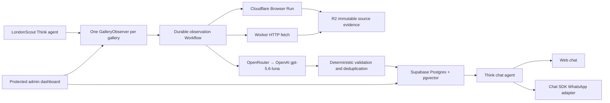

# Zine Local architecture

## What the system does

Zine observes official London gallery sites every day, preserves the source evidence, extracts structured exhibitions/events with Luna, validates candidates deterministically, and publishes the trustworthy subset into a searchable catalogue. The end-user agent searches that catalogue from the web or WhatsApp.

## Why Postgres plus pgvector

Supabase Postgres is the canonical store because galleries, sources, observations, candidates, and event dates are relational and require constraints, transactions, joins, and RLS. The existing vector columns and RPC search remain useful for semantic ranking, but vectors are a derived index rather than the source of truth.

Cloudflare AI Search/Vectorize is not the primary database in this design. It would duplicate authority and make RLS, editorial correction, temporal filtering, and source lineage harder. It can be added later as a read-optimized search cache if measured query volume justifies it. Turborepo is also unnecessary: this Bun workspace is small, and build orchestration is not the current bottleneck.

Storage responsibilities:

| Store | Responsibility |
| --- | --- |
| Supabase Postgres | canonical galleries/events, official source registry, run ledger, candidates, evaluation results |
| pgvector | semantic gallery/event retrieval using 1,536-dimensional OpenAI embeddings via OpenRouter |
| Cloudflare R2 | immutable rendered/raw source snapshots and evidence |
| Durable Objects | per-gallery agent state and schedules |
| Cloudflare Workflows | retried, idempotent, observable multi-step observations |

## Observer lifecycle

1. `LondonScout` reconciles all active `ldn` galleries daily at 01:15 Europe/London and performs a weekly coverage reconciliation on Monday at 01:45.
2. Every gallery maps to one named `GalleryObserver` Durable Object. Its deterministic schedule is distributed over 02:15, 03:15, 04:15, or 05:15 London time to avoid a thundering herd.
3. A scheduled invocation starts `GalleryObservationWorkflow` with the Think idempotency key. The database also makes `observation_runs.idempotency_key` unique.
4. Each allowlisted official source is fetched with its configured strategy. Browser Run is the default; raw HTTP is available for sources proven to be complete without rendering.
5. The bounded response is hashed and archived to R2. An unchanged hash skips model extraction.
6. Luna returns a Zod-validated object with events, evidence, confidence, and same-origin source discoveries.
7. Deterministic checks reject invalid ranges, ended/stale events, missing start dates/evidence, and confidence below 0.82. Borderline candidates go to review instead of becoming public.
8. Published events are deduplicated by a source fingerprint and embedded through OpenRouter.
9. The workflow records completion, partial failure, or unchanged state with per-source metrics.

This is agent-first at the control layer, but not “one unconstrained crawler agent per site.” Agents own memory, schedule, tools, and durable workflows; security, URL scope, idempotency, validation, and publishing remain deterministic code.

## Crawl and extraction strategy

Official gallery domains are the authority. A source can be a home, events, calendar, about, feed, or other page. Discovered URLs are accepted only above 0.8 confidence and only on the same origin as an existing official source.

Use a per-source adaptive cascade:

1. Prefer `http_html` when prior evaluations show the response includes a complete event listing.
2. Use `browser_markdown` for client rendering, anti-bot interstitials, incomplete server HTML, or when a listing-count heuristic shows suspiciously low recall.
3. Escalate repeated failures for human review; do not let the LLM browse arbitrary origins.
4. Re-extract only on content-hash change.

LLM extraction is appropriate for heterogeneous pages, but crawling itself is not agentic guesswork. Browser/HTTP acquisition, limits, evidence archiving, and URL policy are fixed. Luna performs typed semantic extraction; deterministic code decides what is published.

## London test set and first production comparison

`apps/observer/src/london-fixtures.ts` contains 20 official London sources stratified across national institutions, mid-sized venues, independents, and static/hybrid/JavaScript render profiles.

On 2026-08-10, the deployed worker evaluated a representative static/hybrid/JavaScript trio with both techniques and the same Luna schema:

| Fixture | Profile | Browser Run events / time | HTTP events / time |
| --- | --- | ---: | ---: |
| Tate Modern | hybrid | 12 / 27.3s | 3 / 9.7s |
| V&A | JavaScript | 47 / 73.1s | 13 / 17.8s |
| South London Gallery | static | 3 / 11.4s | 3 / 7.1s |

All six runs passed the current structural threshold and had evidence on every extracted item. The meaningful result is recall, not the binary pass: HTTP matched Browser Run on the static fixture but returned far fewer listings for Tate and V&A. Therefore the production default remains Browser Run until ground-truthed per-source recall proves that HTTP is safe. Raw HTTP is an optimization, not a universal replacement.

The next evaluation improvement is a hand-labelled gold set with expected titles/date ranges. `extraction_evaluations` already has precision/recall fields, but the current automated test measures minimum item count, schema validity, evidence presence, duration, and token usage—not true semantic precision/recall.

## Database and RLS

Catalogue tables:

- `galleries`, `gallery_info`, `gallery_hours`
- `events`, `event_info`

Private ingestion/control tables:

- `pages`, `page_content`, `page_structured`
- `gallery_sources`, `observation_runs`, `source_snapshots`
- `event_candidates`, `extraction_evaluations`

RLS is enabled on every table in `public`. `anon` and `authenticated` have only `SELECT` on the five catalogue tables, constrained by read policies; raw/control tables have explicit service-role policies. Broad CRUD/TRUNCATE grants were revoked, public schema creation was revoked, mutable functions have fixed `search_path`, and vector/btree extensions live in the `extensions` schema.

The public event read policy exposes only `published = true`. Worker-side service-role clients are never bundled into browser code.

## Service responsibilities

### `apps/app`

`Zine` is a Think Durable Object. Web sessions enter through `/agents/zine/default`. The four search tools query the public Supabase catalogue and return UI cards on web or compact text on WhatsApp. The model is `openai/gpt-5.6-luna` via OpenRouter.

`/webhook` is handled by the official `@chat-adapter/whatsapp` adapter. The entire messenger is disabled unless access token, app secret, phone number ID, and verify token are all present. This preserves web chat if Meta credentials expire and prevents accepting unsigned WhatsApp traffic.

### `apps/observer`

Owns London discovery/observation, Browser Run, R2 snapshots, per-gallery agents, schedules, workflows, evaluation fixtures, and protected operational endpoints. It is the preferred path for new ingestion.

### `apps/dash`

Provides editorial inspection and the existing manual workflows. Firecrawl was removed; link discovery/scraping uses the direct Browser Run binding. Observer operations are proxied over a Cloudflare service binding. Every route and asset requires Basic auth except `/health`.

### `packages/shared`

Owns the OpenRouter provider, model/embedding names, embedding helpers, strict public vs service-role Supabase factories, shared schemas/types, and UI components.

## Operations

Protected observer routes require `Authorization: Bearer $OBSERVER_ADMIN_TOKEN`:

- `POST /internal/bootstrap` — idempotently registers the 20 fixtures and reconciles schedules
- `POST /internal/galleries` — register/configure one London gallery
- `POST /internal/observe` — force or deduplicate a workflow run
- `GET /internal/runs` — recent run ledger
- `POST /internal/evaluate` — compare fetch techniques
- `POST /internal/diagnostics` — live Supabase, Luna, R2 and Browser Run checks

Health endpoints expose configuration state but never secret values. Production secrets belong in Cloudflare Worker secrets; local `.env` and `.dev.vars` are ignored.

## WhatsApp go-live checklist

1. Create/choose the Meta app and WhatsApp Business system user.
2. Generate a valid long-lived access token and record the Meta App Secret.
3. Set `WHATSAPP_ACCESS_TOKEN`, `WHATSAPP_APP_SECRET`, `WHATSAPP_PHONE_NUMBER_ID`, and `WHATSAPP_VERIFY_TOKEN` on the `zine` Worker.
4. Configure Meta's callback URL as `https://chat.zinelocal.com/webhook` with the same verify token and subscribe to message events.
5. Confirm `https://chat.zinelocal.com/health` reports `whatsappConfigured: true`.
6. Verify the GET challenge, a signed inbound message, read/typing state, and an outbound reply from a real test number.
